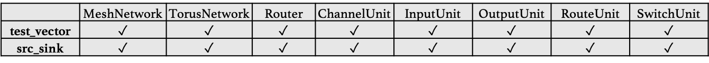
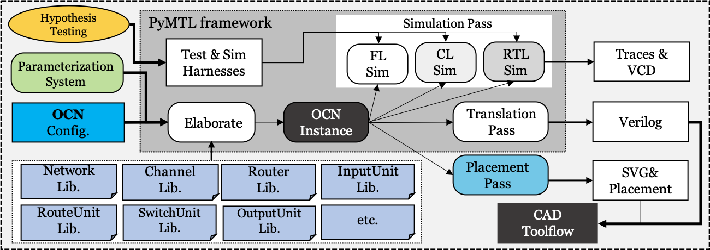
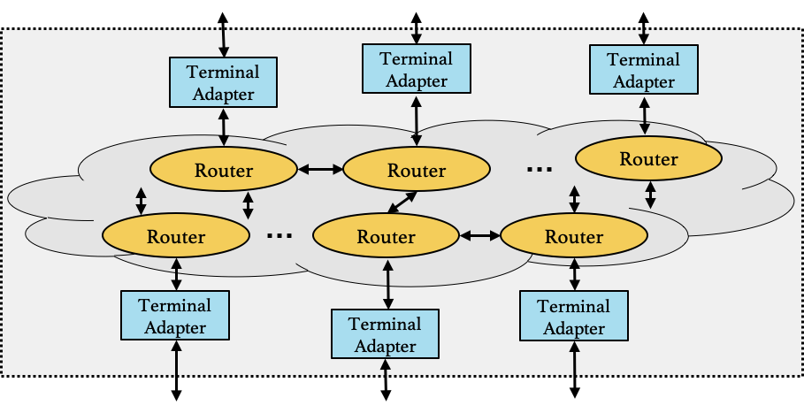
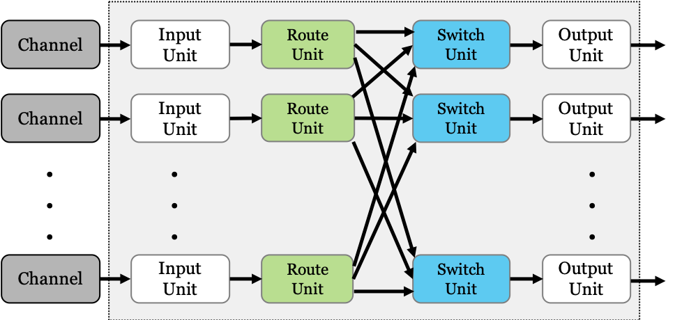

<pre>
=======================================
    ____        ____  _______   __
   / __ \__  __/ __ \/ ____/ | / /
  / /_/ / / / / / / / /   /  |/ / 
 / ____/ /_/ / /_/ / /___/ /|  /  
/_/    \__, /\____/\____/_/ |_/   
      /____/                      
=======================================
</pre>
[](https://travis-ci.com/cornell-brg/pymtl3-net)

PyOCN (PyMTL-OCN Generator) is a parameterizable and powerful OCN (on-chip network) generator to generate synthesizable Verilog for different OCNs based on user-specified configurations (e.g., network size, topology, number of virtual channels, routing strategy, switching arbitration, etc.). It comes with PyMTL implementation and is the first one to provide functional-level (FL), cycle-level (CL), and register-transfer-level (RTL) modeling for building OCNs. Furthermore, POSH OCN Generator is open-source with a modular design and standardized interfaces between modules. The configurability and extensibility are maximized by its parametrization system to fit in various research and industrial needs.

Demo
--------------------------------------------------------

We have a demo at repl.it (https://repl.it/@ChengTan/pymtl3-net-demo), which shows the key features of PyOCN.


Related publications
--------------------------------------------------------------------------

- Shunning Jiang, Christopher Torng, and Christopher Batten. _"An Open-Source Python-Based Hardware Generation, Simulation, and Verification Framework."_ First Workshop on Open-Source EDA Technology (WOSET'18) held in conjunction with ICCAD-37, Nov. 2018.

- Shunning Jiang, Berkin Ilbeyi, and Christopher Batten. _"Mamba: Closing the Performance Gap in Productive Hardware Development Frameworks."_ 55th ACM/IEEE Design Automation Conf. (DAC-55), June 2018. 


License
--------------------------------------------------------------------------

PyOCN is offered under the terms of the Open Source Initiative BSD
3-Clause License. More information about this license can be found here:

  - http://choosealicense.com/licenses/bsd-3-clause
  - http://opensource.org/licenses/BSD-3-Clause


Installation
--------------------------------------------------------
  
PyOCN requires Python3.7 and has the following additional prerequisites:

 - graphviz, verilator
 - git, Python headers, and libffi
 - virtualenv
 - PyMTL3

The steps for installing these prerequisites and PyOCN on a fresh Ubuntu
distribution are shown below. They have been tested with Ubuntu Trusty
14.04.

### Install python3

```
 % sudo apt-get install python3.7
```

### Install graphviz

```
 % sudo apt-get install -y graphviz
```

### Install Verilator

[Verilator][4] is an open-source toolchain for compiling Verilog RTL
models into C++ simulators. PyOCN uses Verilator for Verilog import.

```
 % wget https://github.com/cornell-brg/verilator-travisci-cache/raw/master/verilator-travis-4.008.tar.gz
 % tar -C ${HOME} -xzf verilator-travis-4.008.tar.gz
 % export VERILATOR_ROOT=${HOME}/verilator
 % export PATH=${VERILATOR_ROOT}/bin:${PATH}
 % export PYMTL_VERILATOR_INCLUDE_DIR=${VERILATOR_ROOT}/share/verilator/include
 % verilator --version
```

 [4]: http://www.veripool.org/wiki/verilator

### Install git, Python headers, and libffi

We need to install the Python headers and libffi in order to be able to
install the cffi Python package. cffi provides an elegant way to call C
functions from Python, and PyMTL uses cffi to call C code generated by
Verilator. We will use git to grab the PyMTL source. The following
commands will install the appropriate packages:

```
 % sudo apt-get install git python-dev libffi-dev
```

### Create virtual environment

While not strictly necessary, we strongly recommend using [virtualenv][5]
to install PyMTL3 and the Python packages that PyMTL3 depends on.
virtualenv enables creating isolated Python environments. The following
commands will create and activate the virtual environment:

```
 % python3 -m venv ${HOME}/venv
 % source ${HOME}/venv/bin/activate
```

 [5]: https://virtualenv.pypa.io/en/latest/

### Install PyMTL3 and Python requirements
 
```
 % pip install pymtl3
 % pip install --upgrade pip setuptools twine
 % pip install --requirement requirements.txt
 % pip list
```

### Clone PyOCN repo

We can now use git to clone the PyOCN repo.

```
 % mkdir -p ${HOME}/cornell-brg
 % cd ${HOME}/cornell-brg
 % git clone --depth=50 https://github.com/cornell-brg/posh-ocn.git cornell-brg/posh-ocn
```  

When you're done testing/developing, you can deactivate the virtualenv::

```
 % deactivate
```

Quickview
--------------------------------------------------------

### OCN generator hierarchy:


### Test with a set of simple tests:


### OCN generator design flow:

 
### Generic network architecture:

 
### OCN generic router architecture:


